# ACME - SOFTWARE ARCHITECTURAL DOCUMENTATION PART 2

## Index

- Attribute-driven design (ADD)
    - STEP 1: REVIEW INPUTS
    - ADD Iteration 1
    - STEP 2: ESTABLISH ITERATION GOAL BY SELECTING DRIVERS
    - STEP 3: CHOOSE ONE OR MORE ELEMENTS OF THE SYSTEM TO REFINE
    - STEP 4: CHOOSE ONE OR MORE DESIGN CONCEPTS THAT SATISFY THE SELECTED DRIVERS + INSTANTIATE ARCHITECTURAL ELEMENTS, ALLOCATE RESPONSIBILITIES AND DEFINE INTERFACES + SKETCH VIEWS AND RECORD DECISIONS
    - STEP 5: PERFORM ANALYSIS OF CURRENT DESIGN AND REVIEW ITERATION GOAL AND ACHIEVEMENT OF DESIGN PURPOSE
    - ADD Iteration 2
    - STEP 2: ESTABLISH ITERATION GOAL BY SELECTING DRIVERS
    - STEP 3: CHOOSE ONE OR MORE ELEMENTS OF THE SYSTEM TO REFINE
    - STEP 4: CHOOSE ONE OR MORE DESIGN CONCEPTS THAT SATISFY THE SELECTED DRIVERS + INSTANTIATE ARCHITECTURAL ELEMENTS, ALLOCATE RESPONSIBILITIES AND DEFINE INTERFACES + SKETCH VIEWS AND RECORD DECISIONS
    - STEP 5: PERFORM ANALYSIS OF CURRENT DESIGN AND REVIEW ITERATION GOAL AND ACHIEVEMENT OF DESIGN PURPOSE
- Auto-scaling demonstration - Using JMeter to introduce load

In a previous sprint/project, the ACME application was developed, and configurability issues
were addressed.

### The problem
While this application is functional, it was observed that its centralized (monolithic)
architecture hampers its maintainability, performance, availability, scalability and elasticity.

### Goal

The goal of this sprint/project is to reengineer the ACME application by adopting a
decentralized/distributed approach.

## Attribute-driven design (ADD)

To achieve the goal outlined in the project assignment, a comprehensive architectural design process was undertaken, employing the Attribute-Driven Design (ADD) methodology. The ADD method plays a crucial role in ensuring that all pertinent aspects are thoroughly considered, thereby facilitating the creation of a robust and fitting design. One of its most pivotal characteristics lies in its provision of meticulous, step-by-step guidance, outlining the tasks to be executed within each design iteration.

The ADD model has several advantages, which are:

- **Focus on the user:** The ADD focuses on identifying and modeling the attributes that are important to users and stakeholders, ensuring that the system meets their needs and expectations.
- **Flexible architecture:** By modeling system attributes, ADD allows for a flexible and adaptable architecture that can be easily modified and scaled as system needs change.
- **Easy maintenance:** Because ADD focuses on important and relevant attributes, systems designed with this approach tend to be easier to maintain and scale.
- **Effective communication:** ADD helps create effective communication between developers, users and stakeholders, making it easier to align expectations and ensure that the system meets the needs of everyone involved.
- **Cost reduction:** By designing systems with flexible architecture, easy to maintain and scale, ADD can help reduce maintenance and development costs in the long term.

The following image displays the steps and artifacts provided by the ADD method.

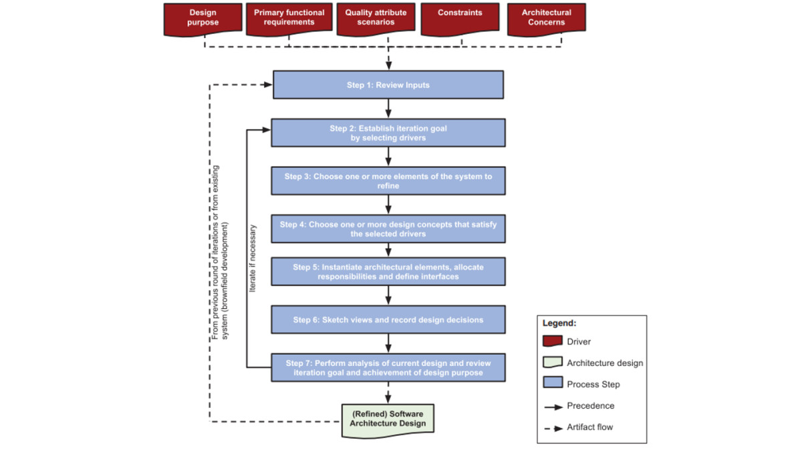      

For pragmatic considerations, steps 4, 5, and 6 in the ADD methodology have been streamlined into a unified step. In the ADD method, Step 6 functions as the stage where the informal documentation or "sketches" conceived during conference discussions undergo migration and are documented formally.

Owing to practical limitations, the presentation will concentrate exclusively on the completed formal documentation. This thorough documentation will showcase polished diagrams for each design concept, vividly delineating the allocation of architectural elements, responsibilities, and interfaces.

### STEP 1: REVIEW INPUTS

### Design purpose

The purpose of the design is to conceptualize a solution that addresses the newly imposed requirements.

### Primary functional requirements

**UC-1:** As product manager, I want to publish a Product (i.e. available for clients, reviewers, voters) only after two other product managers accept it.

**UC-2:** As a reviewer, I want my Review published (i.e. available voters) only if it is accepted by two other users that are recommended with that review (cf. recommendation algorithm).

**UC-3:** As a voter, I want to create a Vote and a Review in the same process (cf. previous requirement).

### Quality attribute scenarios

| ID   | Quality attribute          | Scenario                                                                                                                                           | Associated use case | Importance to customer | Difficulty of implementation according to architect |
|------|----------------------------|----------------------------------------------------------------------------------------------------------------------------------------------------|---------------------|------------------------|-----------------------------------------------------|
| QA-1 | Performance                | The system must increase the performance when in high demand (i.e. >Y requests/period).                                                            | All                 | High                   | High                                                |
| QA-2 | Scalability and Elasticity | The system must use hardware parsimoniously, according to the runtime demanding of the system. Demanding peeks of >Y requests/period occur seldom. | All                 | High                   | High                                                |
| QA-3 | Releasability              | The system must increase releasability frequency.                                                                                                  | All                 | High                   | High                                                |

### Constraints

**CON-1:** The clients should not be affected by the changes in the API (if any).

**CON-2**: The system must adhere to the company’s SOA strategy of API-led connectivity.

**Architectural concerns**

**CRN-1**: Leverage the team’s knowledge about Java technologies (Spring Boot) and docker.

### <u>ADD Iteration 1</u>

### STEP 2: ESTABLISH ITERATION GOAL BY SELECTING DRIVERS

QA-1; QA-2; CON-1; CRN-1

### STEP 3: CHOOSE ONE OR MORE ELEMENTS OF THE SYSTEM TO REFINE

Backend

### STEP 4: CHOOSE ONE OR MORE DESIGN CONCEPTS THAT SATISFY THE SELECTED DRIVERS + INSTANTIATE ARCHITECTURAL ELEMENTS, ALLOCATE RESPONSIBILITIES AND DEFINE INTERFACES + SKETCH VIEWS AND RECORD DECISIONS

#### Architectural concepts

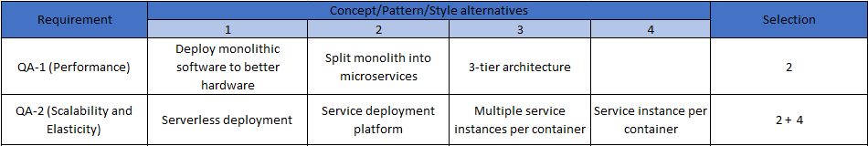

---

#### Technical memo QA-1

<u>Problem</u>

How to address the low performance in responding to the client's requests.

<u>Summary of solution</u>

The use of a microservice architecture.

<u>Factors</u>

- Low performance occurs in overload peak scenarios.
- The team faces difficulties in managing code changes in the current architecture.
- It is assumed that the code already has optimizations in terms of threads, caching, etc.
- The areas covered by the system have distinct responsibilities.
- With the growing of the software managing a big application could be difficult.
- The acquisition of better hardware has a considerable costs.
- The company needs to adhere to API-Led connectivity.

<u>Solution</u>

Implementing a microservices architecture organized according to distinct business areas enhances team management specialization and results in cost savings by eliminating the need to invest in new hardware to support the previous monolithic application.

<u>Motivation</u>

The solution must increase the performance of the software.

<u>Alternatives</u>

- The 3 Tier architecture is already in place: client, server and database already run in different hardware.
- Deploying the software to superior hardware and support associated high costs.

<u>Pending issues</u>

- Which microservices are justifiable to have, in order to support the entire business?
- How services will communicate?
- How to deal with the fact of all services needs to interact with a DBMS?
- What mechanism it must be used to deal with consistency?
- How to adhere to SOA strategy of API-led connectivity
- How to apply testing in microservices?

---

#### Alternatives

**Better hardware**

Improving the application by shifting it to superior hardware is a straightforward solution. No alterations to the code or communication structures are necessary. Essentially, we're taking everything as-is and placing it on more robust hardware. This move ensures the same functionality but with added physical resources, significantly enhancing our ability to handle and process a larger volume of requests.

While the ease and speed are definite good aspects, there's a downside: the high cost. Improving performance is what is necessary, but we can't ignore the price tag, which is considerable and also tied us to an infrastructure provider.

**Monolithic (3 Tier)**

It's the current strategy used, where involves a conventional client-server-database architecture. However, it results in a tightly coupled system with a substantial monolithic application. This application has already applied strategy in code to boost performance significantly, and the removal of ONION pattern is not an option.

**Microservices**

The appeal of microservices lies in their ability to enhance scalability, facilitate continuous delivery, and enable independent service deployment. Unlike monolithic structures, microservices allow for isolated updates and maintenance, minimizing disruptions to the entire system. This modular approach also promotes flexibility in technology stack choices, enabling the use of the most suitable tools for each microservice.

Moreover, microservices facilitate easier scaling of individual components based on demand, optimizing resource utilization. This contrasts with the all-or-nothing scaling of monolithic applications. Additionally, development teams can work independently on different services, fostering parallel development and speeding up the release cycle.

However, it's crucial to note that transitioning to microservices involves overcoming challenges like those that were cited in the Technical Memo QA-1, like managing communication, data consistency across services, etc.

| Criteria                    | Better Hardware                   | Monolithic (3 Tier)                           | Microservices                                         |
|-----------------------------|-----------------------------------|-----------------------------------------------|-------------------------------------------------------|
| **Architecture**            | Hardware-focused improvement      | Conventional client-server-database structure | Modular, independent services with APIs               |
| **Changes Required**        | Minimal, no code alterations      | Code enhancements for performance improvement | Transition requires restructuring and changes         |
| **Cost**                    | High cost for superior hardware   | Moderate, but potential scaling challenges    | Potential for cost optimization with scaling          |
| **Dependency**              | Tied to infrastructure provider   | Less dependent on external factors            | Potential dependencies on inter-service communication |
| **Flexibility**             | Limited due to fixed hardware     | Limited flexibility in technology stack       | Flexible technology choices for each service          |
| **Scalability Granularity** | Limited by hardware capacity      | Limited by monolithic structure               | Granular scalability with individual services         |
| **Challenges**              | High cost and provider dependency | Tightly coupled, potential scaling challenges | Communication, data consistency challenges            |

**The choice is Microservices**

#### Which microservices are justifiable to have, in order to support the entire business?

We will now explore the process of breaking down a monolith into microservices and examine the strategies and patterns that help us in this process.

**Domain-Driven Design (DDD)**

Domain-Driven Design (DDD) isn't directly tied to microservices, but it complements the decentralized nature of microservices architecture. DDD focuses on shared understanding of the problem domain, aiding in the decomposition of monolithic applications into microservices. By defining bounded contexts for each microservice, DDD ensures focused functionality, supporting independent development and scalability. DDD's core concepts, like aggregates and entities, provide a solid foundation for modeling complex business domains, addressing challenges of consistency and autonomy in the microservices landscape. Integrating DDD with microservices achieves a modular and scalable system that accurately reflects the intricacies of the problem domain.

In the case of ACME, the organizational division is represented in the figure below. Each service is focused on its specific context. For instance, in the Review context (2nd), the service only needs to know the product SKU to determine the product's existence and the respective association. This focused approach is mirrored in the Vote context (3rd), where the service needs only the associated review information without requiring access to the entire dataset.

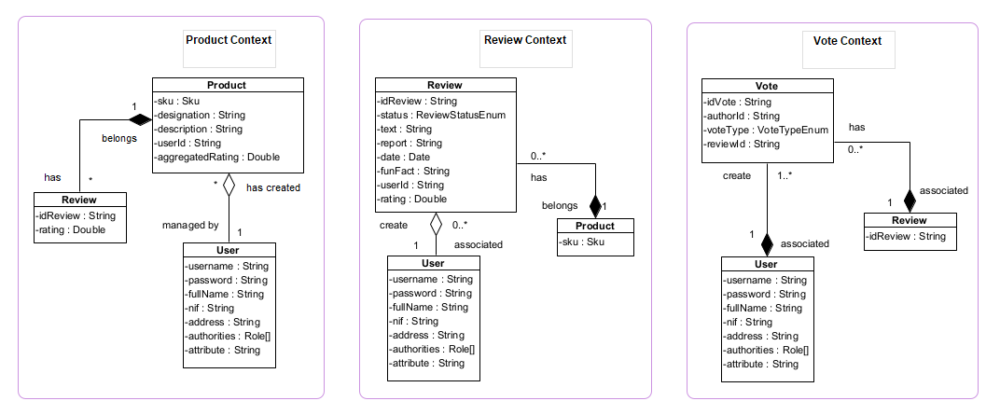

**Self Contained Systems**

Self-Contained Systems (SCS) is an architectural pattern that places a strong emphasis on creating autonomous and independent modules or systems, each encapsulating its unique functionality and data. Typically encompassing a Web UI and a dedicated persistence layer, an SCS may or may not serve an API based on specific requirements. Crucially, in this pattern, the UI is not shared, and each SCS possesses its own user interface.

This pattern lies in a really finely-grained scope, allowing a laser focus on user stories. Utilizing strategies such as user journeys becomes instrumental in understanding and refining the architecture. For instance, a customer journey, which delineates the steps a customer takes while interacting with the system (e.g., searching for products, making a review, or voting), can serve as a blueprint for delineating SCSs. Each step within this journey inherently becomes a potential candidate for an SCS

In essence, the SCS architectural pattern not only promotes autonomy and independence at a modular level but also aligns seamlessly with the user-centric nature of customer journeys, facilitating a more intuitive and efficient system design.

In the figure diagram below, we present an application of a possible SCS architectural pattern, focusing on the extraction of core functionalities derived from a user journey analysis.

> Please note that this diagram is for demonstration purposes, and it doesn't comprehensively represent all the necessary SCS components required to support the entire system. Instead, it selectively highlights a subset of SCSs corresponding to key steps in the user journey.

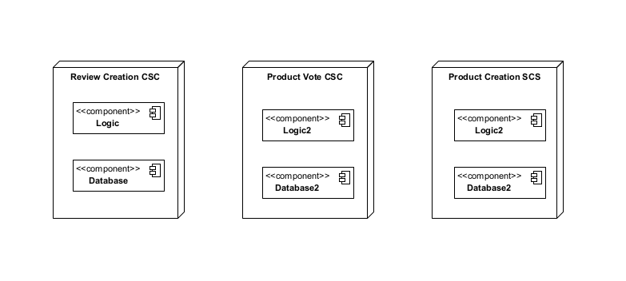

**Strangler fig Pattern**

The Strangler Fig pattern involves gradually replacing functionalities within the monolithic application with microservices. Instead of building new microservices alongside the monolith, this approach focuses on incrementally "strangling" the monolith by replacing or refactoring specific functionalities.

With the Strangler Pattern, the approach significantly reduces risks by allowing a gradual decomposition over time. This deliberate pacing, coupled with focused testing, prevents the pitfalls associated with attempting an all-encompassing migration simultaneously. This method ensures that the design evolution is well-thought-out, preventing the creation of a suboptimal architecture in the process.

Moreover, this incremental migration allows for dedicated teams to familiarize themselves with the new microservices as they are introduced. This phased approach not only minimizes disruptions but also fosters a smoother transition for the development teams, enhancing their understanding and proficiency with the evolving architecture.

In essence, the Strangler Pattern aligns risk mitigation with a structured and phased migration, offering a balanced strategy that prioritizes thoughtful design and team adaptability throughout the decomposition process.

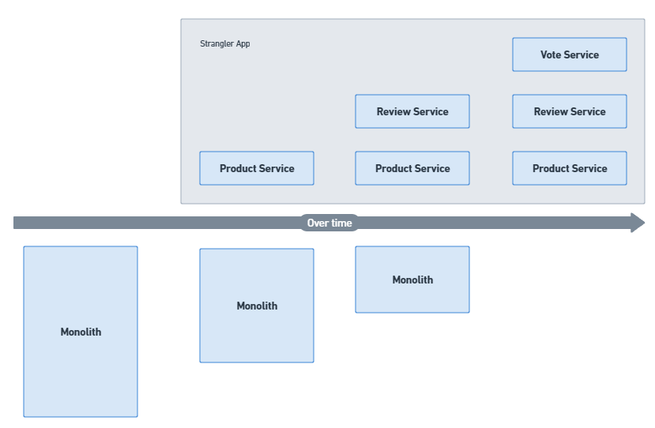

As shown in the figure above, using the Strangler Fig pattern, a suggested solution is to first migrate the Product context to microservices. This is because it involves a less used scope, given that products are already created, and the creation of new product is less common. The second phase would involve migrating the Review context, as the creation of a review is the most used operation. The final phase would focus on migrating the Vote context, considering its increased interaction and sensitivity within the system. The logic behind this division is based on Domain-Driven Design (DDD) principles.

| **Aspect**                 | **Self-Contained Systems (SCS)**                                                                                             | **Strangler Fig Pattern**                                                                                                                    |
|----------------------------|------------------------------------------------------------------------------------------------------------------------------|----------------------------------------------------------------------------------------------------------------------------------------------|
| **Architectural Emphasis** | Emphasizes creating autonomous and independent modules or systems. Each SCS encapsulates unique functionality and data.      | Focuses on gradually replacing functionalities within the monolithic application with microservices. Incrementally "strangles" the monolith. |
| **Scope**                  | Operates at a finely-grained level, allowing a laser focus on user stories.                                                  | Focuses on gradual decomposition of the monolith, allowing for selective replacement of functionalities.                                     |
| **Decomposition Approach** | Encourages the identification of modules based on user journeys. Each step in a customer journey can become a potential SCS. | Focuses on incremental migration by replacing or refactoring specific functionalities within the monolithic application.                     |
| **Team Adaptability**      | Promotes a more heavy system design, aligning with the user-centric nature of customer journeys.                             | Enhances team adaptability by allowing a phased migration, preventing disruptions and fostering a smoother transition for development teams. |

After considering the three possibilities, the chosen approach is to implement the **Strangler Fig pattern with DDD principles for the decomposition of the monolith into microservices**. This decision is driven by the fact that SCS is more appropriate for domains where there is a user interface for user stories, which is not the case in this scenario. Additionally, the Strangler Fig pattern is considered more suitable for the specific characteristics of the domain, making it a better fit compared to other alternatives.

#### How services will communicate?

**Async (AMQP)**

AMQP is an open-standard **messaging** protocol designed for efficient and reliable message communication
between different software applications or components. AMQP enables communication between systems that
may be developed in different programming languages and running on different platforms.

AMQP is designed to facilitate the exchange of messages between applications. Messages can include data,
commands, or any other type of information.

This protocol uses a message queue architecture, where messages are sent to and stored in queues until
they are consumed by the intended recipient. This helps in decoupling the sender and receiver of messages,
ensuring that messages are not lost even if the sender and receiver are not available at the same time.

AMQP supports a publish-subscribe pattern, where multiple consumers can subscribe to receive messages
from a single publisher as shown in the image below (e.g. using the product created message).
This allows for the broadcast of messages to multiple recipients.

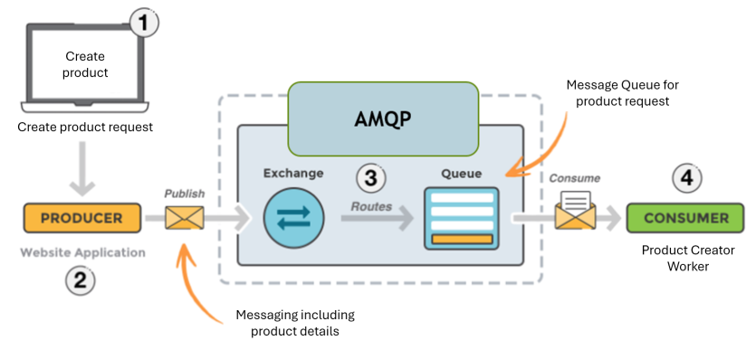

**Message Broker - Rabbit MQ**

A message broker is an intermediary software component that facilitates communication and message
exchange between different applications or services. It acts as a middleman, receiving messages
from message producers and delivering them to message consumers based on
certain routing and delivery rules. Message brokers are essential in building distributed and
decoupled systems, enabling asynchronous communication between components.

RabbitMQ, specifically, is a popular open-source message broker that implements the AMQP protocol talked
before. RabbitMQ facilitates the exchange of messages between various components of
a distributed system. It acts as a centralized hub where messages are sent by producers and then
routed to the appropriate consumers.

**Sync (HTTP)**

HTTP is an application-layer protocol used for transmitting and receiving information on the
web.

The service that initiates the communication by making an HTTP request is the service consumer or client.
The consumer sends an HTTP request to the service provider to request a particular operation or resource.
The service provider or server receives the HTTP request from the consumer.
It processes the request, performs the necessary actions, and generates an HTTP response.
The service provider sends an HTTP response back to the consumer in response to the original request.
The response includes a status code indicating the success or failure of the operation,
headers providing additional information, and, if applicable, a response body containing data.

This protocol follows a synchronous communication. It means that the consumer waits for the response
before proceeding with further actions.

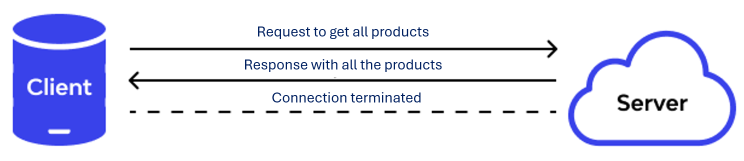

| **Aspect**              | **AMQP**                                                                                         | **HTTP**                                                                                                  |
|-------------------------|--------------------------------------------------------------------------------------------------|-----------------------------------------------------------------------------------------------------------|
| **Communication Style** | Asynchronous messaging with queues.                                                              | Synchronous communication with a client-server model.                                                     |
| **Message Format**      | Typically, uses serialized data formats like JSON or XML for messages.                           | Uses headers and payload, commonly in JSON or XML format.                                                 |
| **Reliability**         | Guarantees delivery with features like acknowledgments and persistence.                          | Relies on protocols like REST, may require additional mechanisms for reliability (e.g., retries).         |
| **Scalability**         | Well-suited for large-scale systems with distributed components.                                 | Suitable for various scenarios, but may require additional strategies for scalability.                    |
| **Use Cases**           | Ideal for scenarios with high message volume, event-driven architecture, and decoupled services. | Suited for simple request-response interactions and scenarios where real-time communication is essential. |

After considering the two possibilities, the chosen approach is to use **AMQP protocol**.
This decision is driven by the fact that AMQP is well-suited for asynchronous communication and decoupling
of microservices. It facilitates message-oriented communication through queues.
For the requirement of publishing a Product only after two other product managers accept it, for example, an
asynchronous approach using queues can help decouple the acceptance process from the publishing process.
Additionally, AMQP can respond to our particular needs of scalability and performance.

#### How to deal with the fact of all services needs to interact with a DBMS?

**Shared Database Pattern**

In the Shared Database pattern, multiple microservices share a common database. This means that all
microservices have direct access to the same database schema, and they can read and write data to it.
While this pattern may simplify some aspects of development, it often leads to challenges such as
tight coupling between services, making it harder to evolve and maintain the system.
Changes to the database schema can affect multiple services, and there's a risk of unintended consequences.

**Database Per Service Pattern**

In the Database Per Service pattern, each microservice has its own database. Each service manages its
data independently, and there is no direct access to the database of another service.
This pattern promotes loose coupling between services and allows them to evolve independently.

| **Aspect**                          | **Shared Database Pattern**                                   | **Database Per Service Pattern**                                |
|-------------------------------------|---------------------------------------------------------------|-----------------------------------------------------------------|
| **Coupling**                        | High coupling due to shared database schema and direct access | Low coupling as each service has its own independent database   |
| **Flexibility**                     | Limited flexibility for evolving services independently       | High flexibility for evolving services independently            |
| **Data Consistency**                | Easier to maintain consistency as data is centralized         | Requires additional mechanisms for maintaining consistency      |
| **System Maintenance**              | Changes to the database schema can impact multiple services   | Changes are isolated to individual services, easier maintenance |
| **Risk of Unintended Consequences** | Higher risk as changes may affect multiple services           | Lower risk as changes are contained within individual services  |

After considering the two possibilities, the chosen approach is to use the **Database Per Service Pattern**.
The Database Per Service pattern aligns well with our goals of improving
performance, resource utilization and releasability frequency. It provides the necessary flexibility and
independence for each microservice to evolve and scale according to our specific requirements.

**Use of polyglot persistence**

Polyglot persistence is a database architecture strategy that involves using multiple types of databases
to handle different aspects of data storage within a single application or system. The term "polyglot"
is borrowed from linguistics, where it refers to someone who speaks multiple languages.
Similarly, in the context of databases, polyglot persistence signifies using multiple database
technologies to cater to diverse data storage and processing needs.

The primary motivations behind adopting a polyglot persistence approach are as follows:

- Different types of data may be best represented by different data models. For example, a
  relational database might be suitable for structured transactional data, while a document-oriented
  database could be better for storing semi-structured or unstructured data. Polyglot persistence allows
  each data type to be stored in a database optimized for its specific data model.

- Certain databases are designed to excel in specific functionalities. For instance, a graph database
  might be excellent for handling relationships between entities, while a time-series database is
  well-suited for managing time-stamped data. By employing specialized databases, we can optimize
  performance for particular types of operations.

- In our case, we are changing a system that follows ONION architecture with support
  to MongoDB and Postgresql. This allows an easy adaptation to the required goal of having different
  database technologies for each service.

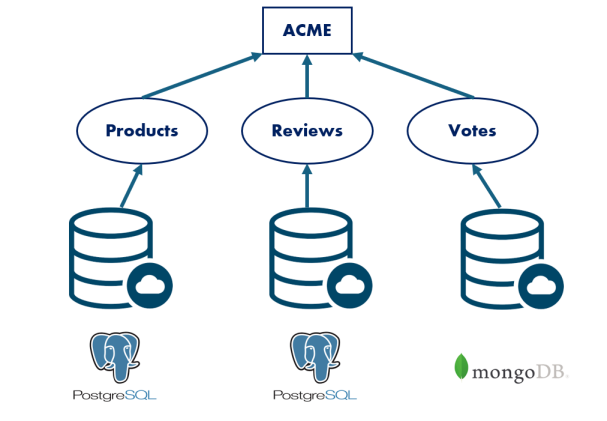

#### What mechanism it must be used to deal with consistency?

The chosen database per service patter promotes loose coupling between services and allows them to evolve
independently. However, it introduces challenges related to maintaining data consistency across services.
This problem leads us to another discussion:

**Database Federation vs Domain Events**

- Database Federation:

Database Federation is an approach to maintaining data consistency in a system that follows the
Database Per Service pattern. Instead of having a single, centralized database, federation involves
coordinating data across multiple databases. This coordination can be achieved through mechanisms
like distributed transactions or eventual consistency strategies. The goal is to ensure that
changes in one microservice's database are reflected appropriately in other microservices' databases,
preserving overall data consistency.

- Domain Events:

Domain Events are a concept related to the publish-subscribe pattern. In a microservices architecture,
when a microservice performs an operation that should be of interest to other parts of the system,
it publishes an event. Other microservices subscribe to these events and can react accordingly.
Domain Events provide a way for microservices to communicate asynchronously without direct dependencies
on each other. They play a crucial role in achieving eventual consistency in a system.

In a Database Per Service pattern, domain events can be used to propagate information about changes
in one microservice's database to other microservices. When a microservice updates its data, it publishes
a domain event, and other microservices can subscribe to these events to update their own data
accordingly. This helps in achieving a loosely coupled and eventually consistent system.

> Reason to discard database federation:
> Scaling a system with database federation can be challenging.
As the number of microservices and databases grows, coordinating changes across all of them becomes
more complex and may limit scalability. Additionally, the costs can be very high.

**ACID vs BASE**

ACID and BASE are acronyms for different database properties that represent how the database behaves
when processing online transactions.

**ACID**

ACID stands for atomicity, consistency, isolation and durability.

- Atomicity ensures that all steps in a single database transaction are fully completed or revert
  to their original state. For example, in a reservation system, both tasks - reserving seats and
  updating customer details - must be completed in a single transaction. We cannot have seats
  reserved for an incomplete customer profile. No changes will be made to the data if any part of
  the transaction fails.

- Consistency ensures that data meets integrity constraints and predefined business rules. Even if
  several users perform similar operations simultaneously, the data remains consistent for everyone.
  For example, consistency ensures that when transferring funds from one account to another,
  the total balance before and after the transaction remains the same.

- Isolation ensures that a new transaction, accessing a specific record, waits until the previous
  transaction has finished before starting the operation. It ensures that simultaneous transactions do
  not interfere with each other, maintaining the illusion that they are being executed in series.
  Another example is a multi-user inventory management system. If one user updates the quantity of a
  product, another user accessing the same product information will have a consistent and isolated view
  of the data, unaffected by the update in progress until it is confirmed.

- Durability ensures that the database keeps all confirmed records, even if the system fails.
  It ensures that when ACID transactions are committed, all changes are permanent and unaffected by
  subsequent system failures. For example, in a messaging application, when a user sends a message and
  receives a successful delivery confirmation, the durability property ensures that the message is never
  lost. This remains true even if the application or server encounters a failure.

**BASE**

BASE stands for basically available, flexible and eventually consistent state. The acronym emphasizes
that BASE is the opposite of ACID, like its chemical equivalents.

- Basically available is the simultaneous accessibility of the database by users at all times. A user
  does not have to wait for others to complete the transaction before updating the record. For example,
  during a sudden increase in traffic on an e-commerce platform, the system can prioritize the serving
  of product listings and the acceptance of orders. Even if there is a slight delay in updating
  stock quantities, users continue to check out items.

- Flexible state refers to the notion that data can have transient or temporary states that can change
  over time, even without external triggers or inputs. It describes the transition state of the record
  when several applications update it simultaneously. The value of the record is finally finalized only
  after all transactions have been completed. For example, if users edit a post on social media, the
  change may not be visible to other users immediately. However, later on, the post is updated on its
  own (reflecting the older change), even if no user has acted on it.

- Eventually consistent means that the record will achieve consistency when all simultaneous
  updates have been completed. At that point, the applications that query the registry will see
  the same value. For example, consider a distributed document editing system where several
  users can edit a document simultaneously. If User A and User B edit the same section of the document
  simultaneously, their local copies may differ temporarily until the changes are propagated
  and synchronized. However, over time, the system ensures eventual consistency by propagating and
  merging the changes made by different users.

|                     | **ACID**                                                                        | **BASE**                                                                            |
|---------------------|---------------------------------------------------------------------------------|-------------------------------------------------------------------------------------|
| **Scale**           | Scale vertically                                                                | Scales horizontally                                                                 |
| **Flexibility**     | Less flexible Blocks specific records from other applications during processing | More flexible. Allows several applications to update the same record simultaneously |
| **Performance**     | Performance decreases when processing large volumes of data                     | Capable of handling large, unstructured data with high throughput                   |
| **Synchronization** | Yes. Adds synchronization delay                                                 | No synchronization at the database level                                            |

The chosen database property was **BASE**.
BASE databases prioritize availability and partition tolerance over immediate consistency. In our
decentralized/distributed architecture, this can lead to better performance, especially during
high-demand periods.

Additionally, BASE allows for more flexible scaling, accommodating demanding peaks without sacrificing
availability. This aligns well with the requirement to increase performance during high demand.
Releasability Frequency:

BASE databases, by prioritizing availability and soft state, can support frequent releases without
causing disruptions. This aligns with the goal of increasing releasability frequency.

#### How to adhere to SOA strategy of API-led connectivity?

By strategically employing microservices, we effectively align with the SOA strategy, assigning a dedicated microservice to each specialized area of ACME system. Where we will not have a monolith for all the system, but instead a service for each one.

Taking into account the company's dedication to API-led connectivity, coupled with the selected database per service pattern, and recognizing the prevalence of READ operations over WRITE operations in the system, we've chosen the CQRS pattern to help in this constraint.

As shown in the figure below, the strategy was concentrated on Reviews due to its significance as a service with substantial load. In this scenario, we've implemented the Experience API, encompassing both the 'Mobile API' and 'Browser API,' with a focus on streamlining client interactions with the system in an agile manner.

For the Mobile API, requests are paginated, optimizing performance on the frontend and in communication. This pagination is validated through the headers of user-agent.

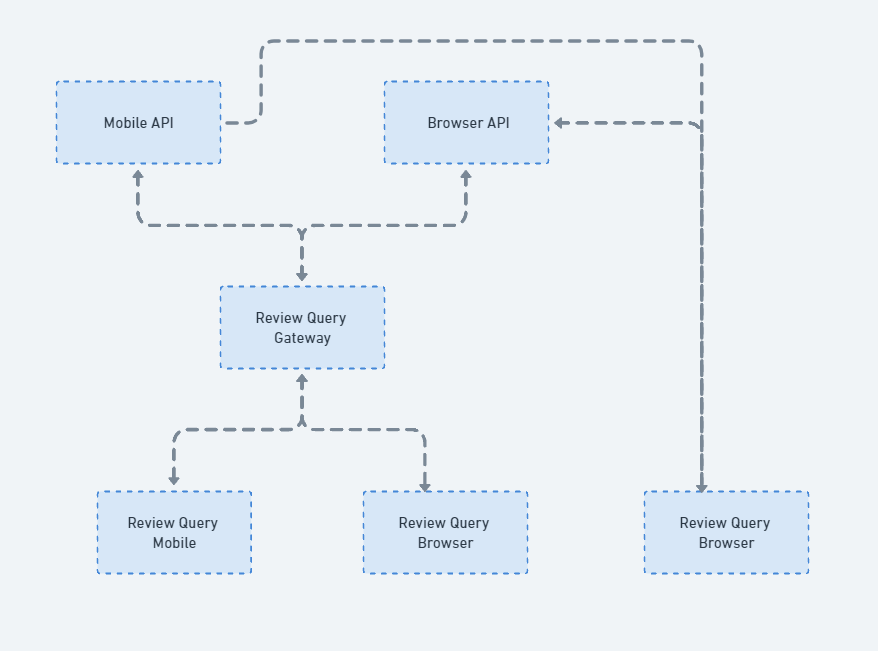

#### How to apply testing in microservices?

One of the critical challenges in adopting microservices architecture lies in the extensive testing required for the integration and functionality of each service. With independent teams working on individual microservices, ensuring that everything operates cohesively becomes more complex. 

Given that it will be compared two strategies.

**End to end (E2E)**

End-to-End Testing is a comprehensive testing strategy that evaluates the entire microservices system as a unified entity. This approach involves testing the entire application flow, simulating real-world user scenarios from start to finish. In the context of microservices, E2E testing spans across multiple services, validating their interactions and ensuring the system behaves as expected. 

Slowness: E2E tests tend to be slow, as they simulate the entire application flow. 

Expense and Maintenance: E2E tests are often expensive to develop and maintain. Their complexity and the need for regular updates to keep pace with system changes contribute to higher costs and resource requirements.

Fragility: E2E tests are prone to breaking easily, especially when there are changes in the system. Even minor modifications to the user interface or the flow of the application can necessitate significant adjustments to the tests.

Environmental Dependency: E2E tests of larger systems may be challenging or impossible to run outside a dedicated testing environment. 

**Consumer-driven Contract Testing (CDC)**

CDC Testing is a testing approach in the context of microservices architecture that focuses on the contracts established between services. In a microservices architecture, different services often interact with each other, and in this case of ACME is through messaging. These interactions are based on contracts, which define the expected behavior and data formats between the services.

Consumer-Driven Contract Testing involves two main roles:

Service Providers: These are the services that notify the messages to the broker. They are responsible for specifying the contracts that dictate how the message is sent. For example, the Product microservice that sends a "product.created" event.

Service Consumers: These are the services that consume the messaging payloads provided by the service providers. Service consumers define the contracts they expect from the service providers. For example, the Review microservices that needs to be notified of the event "product.created" in order to register the SKU product.

Faster Development Cycles: With early identification of contract violations, development teams can iterate and make necessary adjustments faster.

Improved Collaboration: By involving both service providers and consumers in defining and validating contracts, CDC Testing creates a solid collaboration and communication between teams, ensuring a shared understanding of expectations.

Early Detection of Issues: CDC Testing enables the early detection of contract mismatches or issues in messaging between service providers and consumers, reducing the chances of integration problems during later stages of development or deployment

Potential for Test Duplication: Depending on the number of service providers and consumers, there may be a risk of duplicating contract testing efforts.

In the diagram bellow is possible to see how this type of tests works.

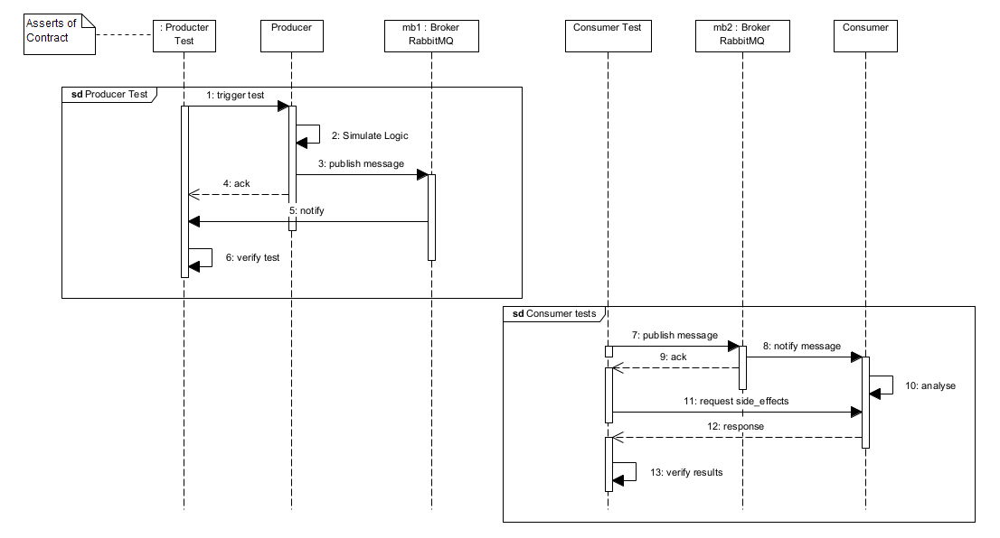

<u>Comparison</u>

| Aspect                       | E2E                                                                      | CDC                                                                                                            |
|------------------------------|--------------------------------------------------------------------------|----------------------------------------------------------------------------------------------------------------|
| **Testing Scope**            | Spans the entire application flow, simulating real-world user scenarios. | Focuses on validating contracts in messaging between service providers and consumers.                          |
| **Speed**                    | Tends to be slow due to simulating the entire application flow.          | Fast as it focuses on specific messaging contracts without executing the entire application flow.              |
| **Expense and Maintenance**  | Often expensive to develop and maintain. Requires regular updates.       | Can be more cost-effective and easier to maintain, with a focus on contract definitions and validations.       |
| **Fragility**                | Prone to breaking easily, especially with changes in the system.         | Less prone to breaking as it focuses on specific messaging contracts, minimizing the impact of system changes. |
| **Environmental Dependency** | May require specific testing environments for larger systems.            | Can be executed in various environments, making it more scalable and flexible.                                 |
| **Early Issue Detection**    | May not catch contract issues early in the development lifecycle.        | Enables early detection of contract mismatches, reducing integration problems in the early stages.             |

Considering the figure bellow of [Microsoft blog](https://microsoft.github.io/code-with-engineering-playbook/automated-testing/cdc-testing/), that shows that as the system grows, E2E testing gets complex, expensive, and slower in issue detection, plus the analysis over the table - for now, opting for CDC testing seems more practical. The goal is to eventually use both strategies, each for different aspects, but currently, **CDC is the chosen approach.**

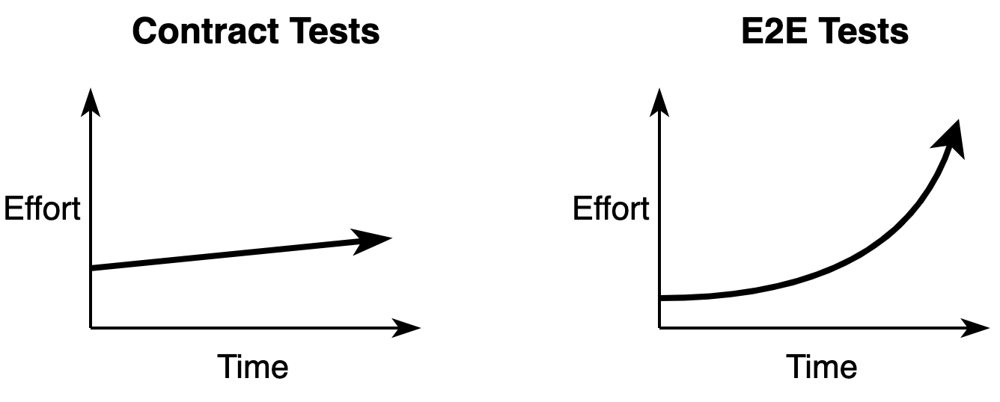

**Observability**

Observability in the context of microservices refers to the ability to gain insights into the internal 
workings of a distributed system by collecting and analyzing relevant data. It involves monitoring, 
logging, and tracing components of microservices architecture to ensure that developers and operations 
teams can understand, troubleshoot, and optimize the system's performance effectively. The key components 
of observability in microservices include:

- Monitoring: involves collecting and analyzing data about the health and performance of 
microservices. This can include metrics such as CPU usage, memory usage, response times, error rates, 
and other relevant indicators. Monitoring helps identify issues, performance bottlenecks, and abnormal 
behavior.

- Logging: is the process of recording events, errors, and other relevant information from 
microservices. Logs provide a historical record of what happened in the system and are crucial for 
debugging and auditing. Properly structured logs can help trace the flow of a request through various 
microservices.

- Tracing: involves tracking the flow of a specific request or transaction as it moves through 
different microservices. Distributed tracing allows teams to understand the end-to-end journey of a 
request, helping to identify latency issues and bottlenecks across multiple services.

- Alerting: Observability also includes setting up alerts based on predefined thresholds or abnormal 
behavior. Alerts notify operators or developers when certain conditions are met, enabling us to 
proactively address potential issues before they impact users.

- Instrumentation: involves adding code to microservices to collect data for monitoring, 
logging, and tracing purposes. This can include adding metrics, logging statements, and trace identifiers 
to facilitate observability.

- "Dashboarding": Dashboards provide a visual representation of the collected data, making it easier for 
teams to monitor and understand the overall health and performance of their microservices. Dashboards 
often consolidate information from various sources to provide a holistic view.

Observability is crucial in microservices architectures because these systems are often complex and 
dynamic, with multiple services communicating over networks. Without proper observability, identifying 
the root cause of issues, understanding system behavior, and optimizing performance can be challenging.

#### Circuit Breaker in Microservices

Microservices architecture, with its advantages, brings challenges like cascading failures. Addressing this, the circuit breaker pattern becomes essential in preventing system-wide disruptions. Communication between microservices is critical, and failures can propagate, causing significant issues. The circuit breaker pattern acts as a fail-safe mechanism to tackle this challenge.

It involves a proxy managing microservices' communication. Developers set a failure threshold, triggering the circuit breaker when surpassed. This initiates a timeout during which requests cease. Post-timeout, a limited number of test requests are sent. Successful tests resume normal operations; otherwise, the timeout persists. The circuit breaker pattern efficiently prevents cascading failures by dynamically adapting to the system's state. It enhances microservices' resilience, ensuring that failures in one service don't lead to widespread disruptions. This approach maintains the overall reliability of microservices-based applications amidst network or service challenges.

<u>Closed state</u>

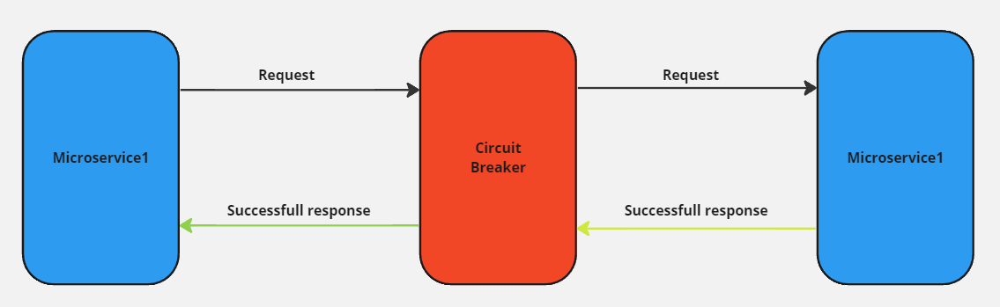

The circuit breaker or proxy begins in the Closed state, enabling regular communication between microservices while keeping track of failures within a designated timeframe. When the failure count surpasses the predetermined threshold, the circuit breaker transitions to the Open state. Conversely, if the failure count does not exceed the threshold, the circuit breaker resets both the failure count and the timeout period.

<u>Open state</u>

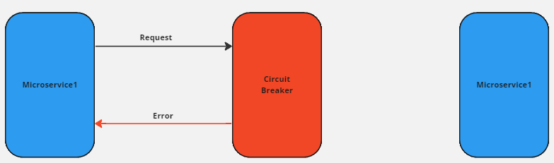

Upon entering the Open state, the circuit breaker initiates a complete block on communication between microservices. Consequently, the article service won't receive any requests, and the user service will encounter an error from the circuit breaker. The Open state persists until the conclusion of the timeout period. Subsequently, the circuit breaker transitions to the Half-Open state.

<u>Half open state</u>

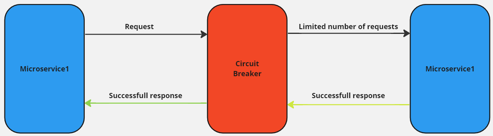

In the Half-Open state, the circuit breaker permits a restricted number of requests to reach the article service. If these requests succeed, the circuit breaker transitions to the Closed state, enabling normal operations. However, if the requests are unsuccessful, the circuit breaker reverts to blocking requests for the designated timeout period. The circuit breaker pattern, as illustrated, is straightforward. Moreover, for almost every major programming language, there are specialized third-party libraries available to streamline the implementation process.

While recognizing the advantages of adopting this pattern, its implementation is likely to be hindered by the restricted timeframe and the team's limited experience in developing microservice-oriented applications.

---

#### Technical memo QA-2

<u>Problem</u>

The system must use hardware parsimoniously, according to the runtime demanding of
the system.

<u>Summary of solution</u>

Use of a service deployment platform for seamless container orchestration and usage of auto-scaling mechanisms.

<u>Factors</u>

- Hardware is expensive, and the costs of providing software must be minimized as much as possible.
- Manually scaling hardware can be hard because loads may surge in an unpredictable manner.

<u>Solution</u>

Deploy each microservice onto a Kubernetes cluster, incorporating horizontal auto-scaling mechanisms to ensure automatic scaling and elastic capabilities. Opt for a service instance per container to enhance the monitoring of individual microservice replicas.

<u>Motivations</u>

- The solution considers the need to use the software parsimoniously.

<u>Alternatives</u>

- Serverless deployment.
- Multiple service instances per container.

<u>Pending issues</u>

How to deploy the software in an effortless manner.

---

#### Alternatives

#### Serverless deployment vs Service deployment platform

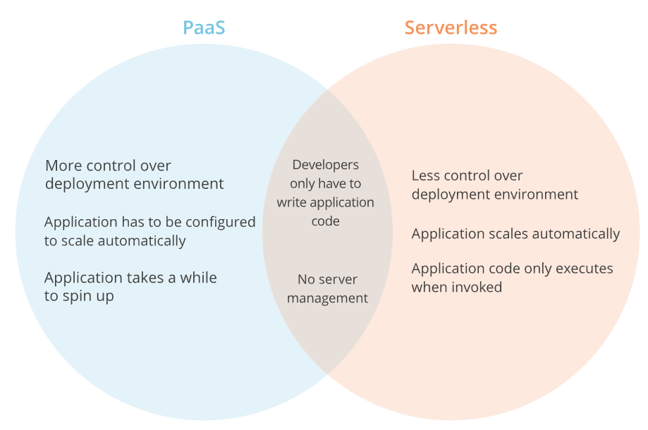

In a serverless architecture, the service provider manages tasks such as provisioning, scaling, load balancing, patching, and securing the underlying infrastructure. The business contracts a deployment service from a third-party vendor, showing no concern for the specifics of the underlying resources. The primary goal is to run the application on a platform, leaving the service provider to select and execute the code for each request. The execution takes place within an isolated environment, such as a container or virtual machine, shielding these details from the service itself.

The serverless deployment infrastructure exhibits high elasticity, akin to drawing water from a tap where water symbolizes computing power. Scaling operations are fast, resembling the seamless act of opening and closing a tap to align with dynamic computational requirements.

Usually, applications that have a large, constant stream of usage that does not fluctuate much may become expensive to run using serverless computing.

Microservices deployment on application deployment platforms involves leveraging high-level services that abstract the deployment process. These platforms manage the deployment abstraction, addressing both non-functional and functional requirements such as availability, load balancing, monitoring, and observability for individual service instances. The automation inherent in these application deployment platforms ensures a reliable, fast, and efficient deployment of the application. (Ex: kubernetes, Docker Swarm, etc.)

#### Multiple service instances per host vs Service per host

There are several microservices deployment patterns available. Some microservice instances can share a host, with either individual processes or multiple instances in the same process. Others can run one service instance per container or VM.

<u>Multiple service instances per host</u>

- The resources could be used very efficiently;
- Difficult to monitor;
- Difficult to isolate instances.

<u>Service instance per host</u>

- All the resources of the VM or container are available for consumption by the service;
- Easy monitoring;
- The service remains entirely isolated.

#### Sequence diagram - create product
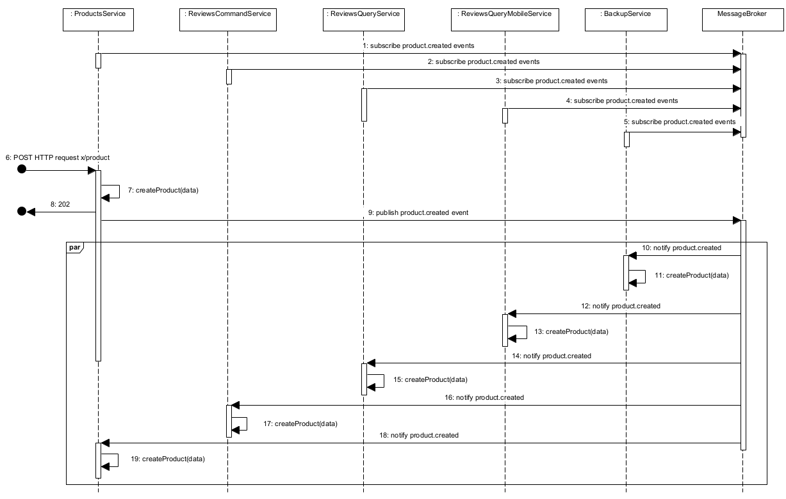

#### Sequence diagram - get reviews
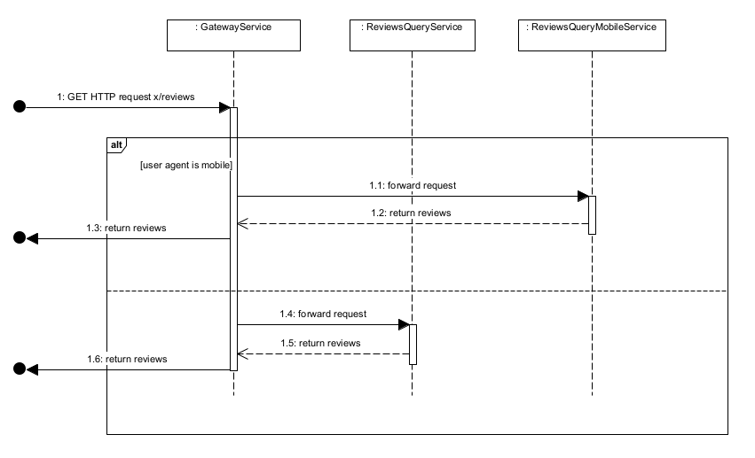

#### Deployment diagram level 2
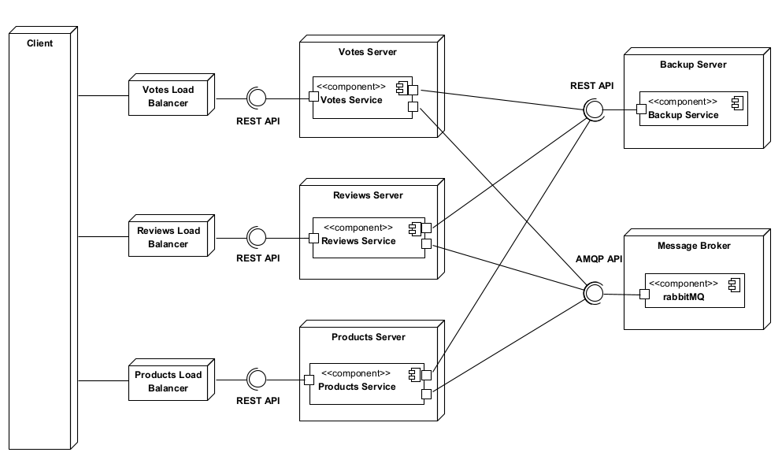

#### Deployment diagram level 3
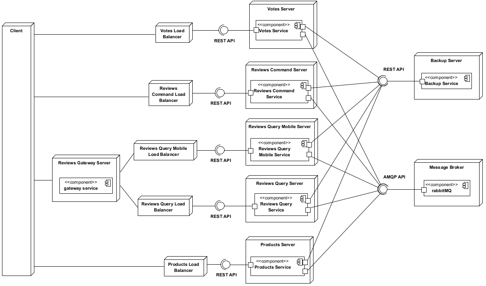

### STEP 5: PERFORM ANALYSIS OF CURRENT DESIGN AND REVIEW ITERATION GOAL AND ACHIEVEMENT OF DESIGN PURPOSE

| Not addressed | Partially addressed | Completely addressed | Design decisions made during the iteration                                                                                         |
|---------------|---------------------|----------------------|------------------------------------------------------------------------------------------------------------------------------------|
|               |                     | QA-1                 | Transition to a microservices architecture by decomposing the existing monolith.                                                   |
|               |                     | QA-2                 | Deploy microservices on a service deployment platform for seamless scaling.                                                        |
|               |                     | CON-1                | Proposed architectural changes do not impact the exposed API.                                                                      |
|               |                     | CRN-1                | Microservices will be developed using the Spring Boot framework and executed within Docker containers in a production environment. |

### <u>ADD Iteration 2</u>

### STEP 2: ESTABLISH ITERATION GOAL BY SELECTING DRIVERS

QA-3; UC-1; UC-2; UC-3

### STEP 3: CHOOSE ONE OR MORE ELEMENTS OF THE SYSTEM TO REFINE

Backend and Infrastructure

### STEP 4: CHOOSE ONE OR MORE DESIGN CONCEPTS THAT SATISFY THE SELECTED DRIVERS + INSTANTIATE ARCHITECTURAL ELEMENTS, ALLOCATE RESPONSIBILITIES AND DEFINE INTERFACES + SKETCH VIEWS AND RECORD DECISIONS

#### Architectural concepts

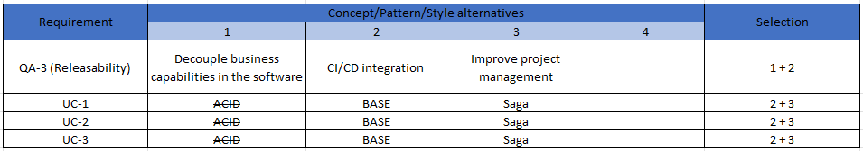

---

#### Technical memo QA-3

<u>Problem</u>

How to increase releasability frequency of the system.

<u>Summary of solution</u>

Decouple business capabilities in the software and integrate CI/CD.

<u>Factors</u>

- It’s hard to release the system due to its incapability of automate the release process itself.
- Manually releases cost time and energy.
- Fewer releases are done because of the process’s difficulty.
- A system with coupled business capabilities makes the releasability a harder achievement.
- Each business component has different releasability needs (e.g. products will have more releases
  than votes).

<u>Solution</u>

Decoupling business capabilities within the software and implementing a
deployment pipeline for each component, streamlining the release process and enhance the efficiency
of the system's deployment.

<u>Motivation</u>

Increase the ease of releasing software and consequently
increase the releases’ frequency.

<u>Alternatives</u>

- Improve project management.

<u>Pending issues</u>

What's the most suitable CD strategy to achieve our needs?

---

#### Alternatives

#### Continuous deployment vs Manually deployment

Manually Deployment involves human intervention at various stages of the deployment process.
Developers or operations personnel manually execute the steps required to release a new version of
software or updates.

On the other hand, Continuous Deployment is an automated approach where changes
to code are automatically tested and deployed to production environments without human intervention.
It aims to reduce the time between writing code and making it available to users.

These two approaches lead us to a discussion to find which one is better for our needs. There are some
key aspects where they differ:

- **Speed and Frequency:**
  Manually Deployment is typically slower as it relies on human actions.
  The speed is limited by the time it takes for manual processes to be executed. Adversely, Continuous
  Deployment is faster and more frequent as the process is automated. Changes can be deployed rapidly,
  sometimes multiple times a day.
- **Testing:**
  In Manually Deployment, testing is often done at the end of
  the development cycle, and errors may be detected late in the process. Contrarily, Continuous Deployment
  make testing an integral part of the deployment pipeline, allowing for early detection of issues and
  faster feedback to developers.
- **Adaptability:**
  Manually Deployment may struggle to keep up with the fast
  pace of modern development and the need for quick releases. Oppositely, Continuous Deployment is highly
  adaptable to changes, allowing for rapid response to market demands and customer feedback.

<u>Chose of Continuous deployment</u>

Continuous deployment offers a strategic advantage over manual deployment by leveraging automation
to enhance speed, reliability, and adaptability. The integration of testing throughout the
development pipeline further contributes to the overall quality of software releases.
These factors make continuous deployment a compelling choice for us seeking to
optimize our ACME delivery processes.

#### Copy replace vs Blue Green deployment

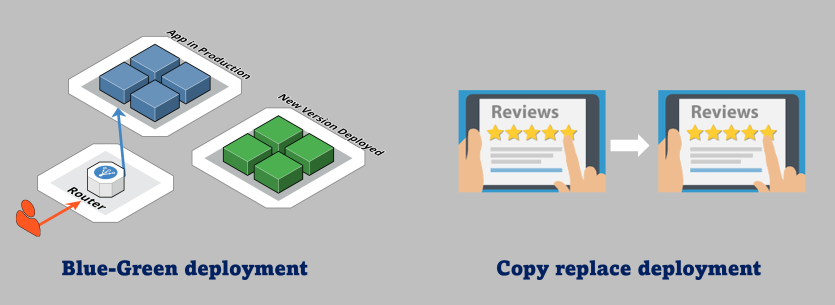

Copy replace deployment and blue-green deployment are both strategies used in software deployment
to minimize downtime and ensure a smooth transition from the old version to the new one.
However, they differ in their approach and implementation:

- **Deployment Process:**
  In copy replace deployment, the new version of the application is deployed alongside the existing version.
  The deployment process involves copying the new version of the application to the target environment.
  Once the copy is complete, the old version is replaced with the new version. In blue-green deployment,
  two identical environments, known as blue and green, are maintained. The new version is deployed to
  the inactive environment (green) while the active environment (blue) continues to run the current version.
  Switching between blue and green is done by adjusting the router or load balancer configuration.

- **Downtime:**
  In Copy Replace Deployment, there may be some downtime during the switch from the old version to the
  new version, as the replacement occurs. Blue-green deployment aims to
  eliminate downtime by switching traffic instantly from one environment to the other.

- **Complexity:**
  Copy Replace Deployment is generally simpler to set up and implement. On the other hand,
  Blue-Green Deployment can be more complex due to the need for duplicate environments and configuration
  of a router or load balancer.

<u>Chose of copy replace</u>

In our particular scenario, we opted against the adoption of blue-green deployment due to its pronounced
complexity, as highlighted earlier. Despite acknowledging the advantages of blue-green deployment in
terms of reduced downtime and simpler rollback procedures, we found that the copy replace strategy
aligns more seamlessly with the overarching objectives of the ACME TP2 project.

#### Jenkins Pipeline

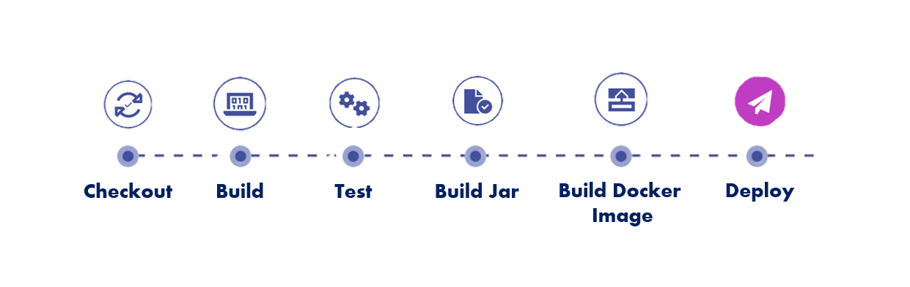

#### Class diagram of bounded services context

The modifications in the class diagrams are centered around incorporating an approval status to facilitate the asynchronous processing of creating reviews, products, and votes.

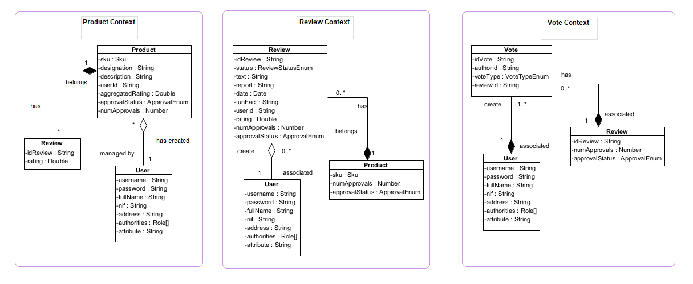

#### Sequence diagram - UC-1
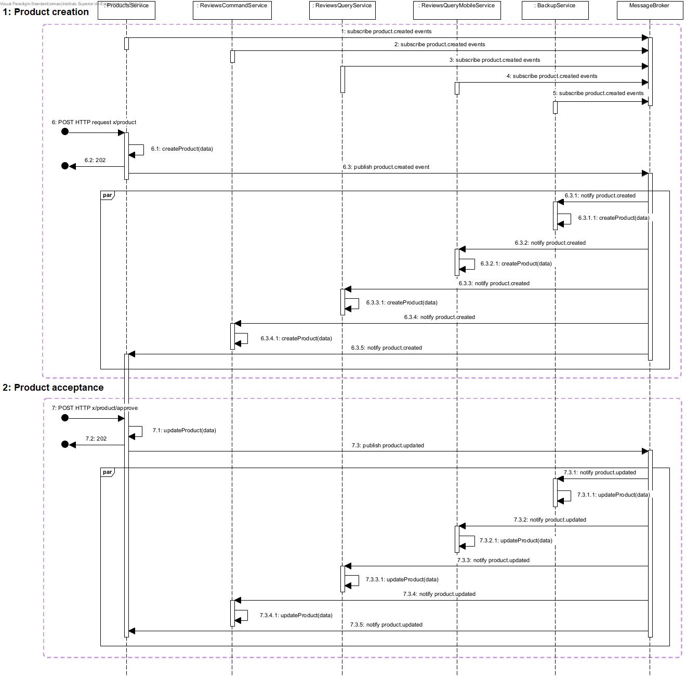

#### Sequence diagram - UC-2 / UC-3
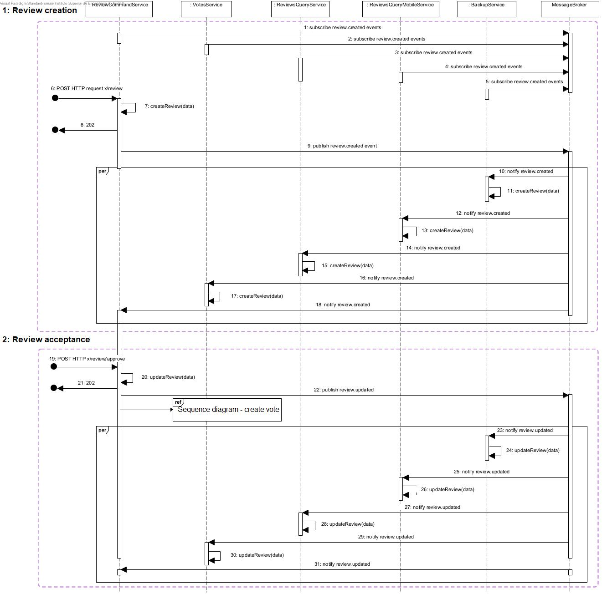

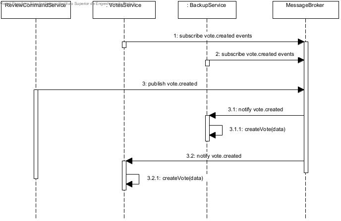

### STEP 5: PERFORM ANALYSIS OF CURRENT DESIGN AND REVIEW ITERATION GOAL AND ACHIEVEMENT OF DESIGN PURPOSE

| Not addressed | Partially addressed | Completely addressed | Design decisions made during the iteration    |
|---------------|---------------------|----------------------|-----------------------------------------------|
|               |                     | QA-3                 | Adoption of a continuous deployment strategy. |
|               |                     | UC-1                 | Distributed Transactions.                     |
|               |                     | UC-2                 | Distributed Transactions.                     |
|               |                     | UC-3                 | Distributed Transactions.                     |

## Auto-scaling demonstration - Using JMeter to introduce load

This section will highlight the automatic scaling functionality, activated when a microservice replica is unable to handle the entirety of incoming requests. To illustrate this, we will employ jMeter to simulate the introduction of requests into the products microservice by making HTTP requests to retrieve the products list.

<u>Initial state</u>

The following figure displays the infrastructure state before introducing load with jmeter.

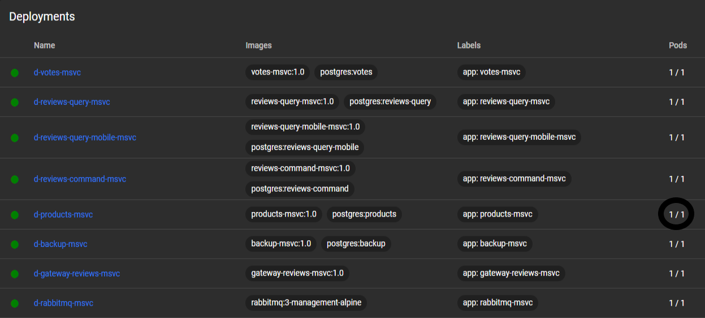

The figure below illustrates a reduction in response times as the test progresses, indicating the deployment of a new replica of the products microservice to efficiently manage the increasing influx of requests.

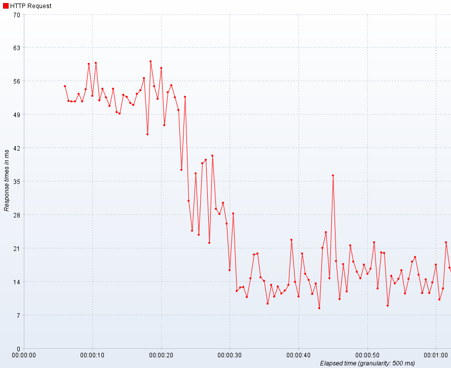

<u>After scaling up</u>

